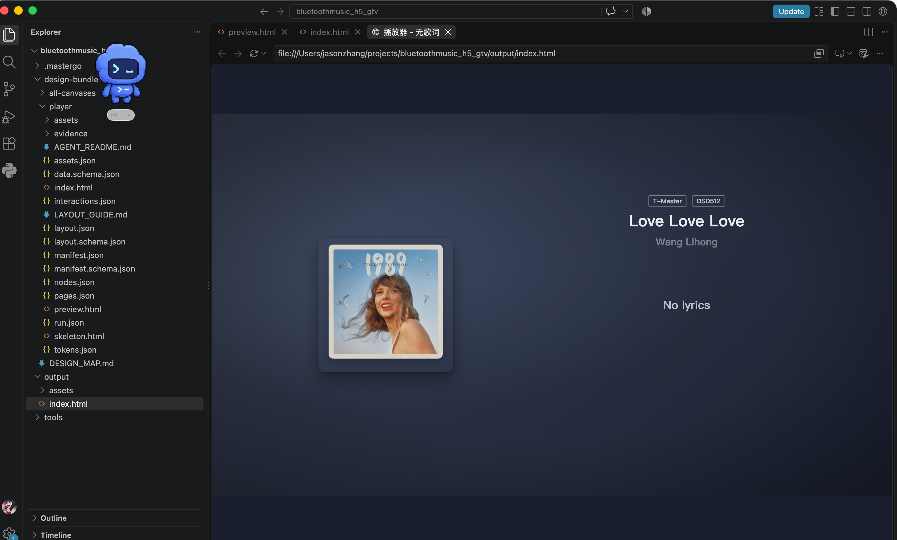
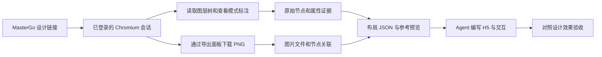

# MasterGo Capture

把 MasterGo 设计链接转成前端 Agent 可以读取的设计资料包：图层树、标注属性、文字、PNG 素材，以及带依据的布局描述。随后由 Agent 基于这些资料实现 H5 页面，并与设计效果对照。

采集程序使用 Python + Playwright 操作正常的浏览器查看界面，不依赖 Computer Use、MasterGo 个人令牌或付费 MCP。需要能正常访问设计文件，并具备相应的查看、导出权限。

## 运行效果



用户提供的实际工作流截图：左侧 `design-bundle/player/` 是采集资料，右侧打开的是后续实现的 `output/index.html` 播放器页面。截图展示了“采集资料 → Agent 消费 → H5 还原”的结果，不代表采集器自动生成了完整应用。最终 H5 的代码目录由项目决定，`output/` 只是此示例的选择。

## 基本原理



1. **浏览器采集**：打开设计链接，切换页面、滚动虚拟图层列表，并按采集范围展开节点。读取的是查看界面中的图层树与标注面板，不是把编辑器画布当作 H5 DOM。
2. **素材导出**：通过设计工具右侧导出面板切换 PNG、设置导出倍率并下载。图片使用内容哈希命名，在 `assets.json` 中关联节点；PNG 不保证等同于未经裁切的原始图片填充文件。
3. **保留原始证据**：将树结构、文字、CSS 标注及完整面板数据写入 JSON。原始值与推断值分开保存，便于核对。
4. **生成派生布局**：预处理得到 `layout.json`，记录坐标换算、角色建议、父级内的层叠顺序和资源关系。无法确定的内容保留未知，角色推断不会自动变成点击行为。
5. **供 Agent 实现**：Agent 根据布局、文字和素材编写组件、样式与业务逻辑，使用参考图核对效果。采集程序本身不需要 AI；H5 实现是后续工作。

## 工作空间：skill 是模板，项目是运行位置

每个 skill 使用独立 Git 仓库。本仓库直接安装在 `.agents/skills/mastergo-capture/`，只维护说明、脚本与干净模板。

初始化后，目标项目的结构如下：

```text
你的项目/
├── tools/mastergo-capture/       # 从 skill 复制的工具源码、启动器与依赖清单
├── .mastergo/                    # 项目专用运行数据
│   ├── project.json             # 角色、相对路径与模板文件哈希
│   ├── ROLE.md                  # 角色说明
│   ├── venv/                    # Python 运行环境
│   ├── browsers/                # Chromium
│   ├── browser-profile/         # 专用浏览器会话
│   ├── auth/                    # 可选的轻量登录态 JSON
│   └── cache/、tmp/、logs/       # 缓存、临时文件与运行记录
└── design-bundle/               # 可交给前端 Agent 的设计资料
    ├── DESIGN_MAP.md            # 全局页面地图
    ├── all-canvases/            # 页面、画板枚举结果
    └── player/                  # 一个画板的完整资料包
```

环境、浏览器及登录文件在执行对应命令时才生成。不要在 skill 目录运行 `uv sync` 或采集；使用项目中的 `run.py`，它会将运行数据固定到项目路径。从其他目录调用该启动器的绝对路径，也不会改变输出位置。

## 基本流程

### 1. 安装 skill，确定角色

准备 Python 3.12+、uv，以及采集时使用的浏览器登录账号。以下安装命令适用于 macOS/Linux；Windows 将仓库克隆到自己使用的 Agent 技能目录即可。

```bash
git clone git@github.com:Jack-monster/mastergo-capture.git ~/.agents/skills/mastergo-capture
```

仓库当前为私有仓库，克隆需要访问权限；也可以使用维护者提供的轻量 ZIP。已安装时进入仓库执行 `git pull`，不重复克隆。

| 角色 | 适用场景 | 工作方式 |
|---|---|---|
| `collector` | 本地采集或更新设计资料 | 登录、采集、导出自己的登录态、布局预处理、校验 |
| `consumer` | 使用现有资料还原 H5 | 读取资料、按需校验；不登录、不采集、不改写资料包 |

角色属于项目。已有角色需要切换时，在初始化命令中显式指定新角色和 `--change-role`。

### 2. 初始化目标项目

将下面的项目路径换成实际绝对路径；Windows 可使用带引号的盘符路径。命令中的 `python3` 可按本机安装方式换成 `python`。

```bash
python3 ~/.agents/skills/mastergo-capture/scripts/init_project.py \
  --project /path/to/your-project --role collector
```

初始化会创建项目工具、角色配置和待整理的 `DESIGN_MAP.md`，不会自动登录或开始采集。重复初始化保留已有产物和地图；遇到不同的工具文件会报告冲突。

### 3. 安装项目环境并登录

后续命令在**目标项目根目录**执行：

```bash
python tools/mastergo-capture/run.py paths
python tools/mastergo-capture/run.py setup --with-browser
python tools/mastergo-capture/run.py login
```

`paths` 显示实际目录；`setup` 只安装运行依赖，不安装 pytest、ruff、mypy 等开发依赖。登录窗口打开后自行完成登录，回到终端按 Enter 保存。首次登录需要桌面环境；采集可以使用无头模式。

Linux 还需安装系统浏览器依赖时，使用：

```bash
python tools/mastergo-capture/run.py setup --with-browser --with-deps
```

### 4. 全局枚举，整理设计地图

先查看文件整体结构，再挑选目标画板，避免直接采集整个文件的全部细节：

```bash
python tools/mastergo-capture/run.py capture \
  --url "https://mastergo.com/file/文件ID?page_id=页面ID" \
  --scope file --flat --export none --out all-canvases \
  --headless --max-nodes 100000
```

`--flat` 不展开折叠节点，因此能枚举的深度取决于图层树当前展开状态；它不是对完整内部设计数据的读取。检查 `pages.json`、`nodes.json` 和 `manifest.json`，再由 Agent 或人工把目标画板名称、节点 ID、产物路径及缺失项整理进 `design-bundle/DESIGN_MAP.md`。地图不会自动按业务含义分组。

### 5. 深度采集目标画板

在设计稿里选中目标画板，使用带 `layer_id` 的链接：

```bash
python tools/mastergo-capture/run.py capture \
  --url "https://mastergo.com/file/文件ID?page_id=页面ID&layer_id=图层ID" \
  --scope layer --export roots-and-leaves --out player --headless \
  --download-timeout-ms 60000 --export-wait-ms 8000
```

这会写入 `design-bundle/player/`。默认 `roots-and-leaves` 导出采集根及符合条件的非文字叶子节点；可用 `roots` 只获取根效果图，或 `none` 只采集结构和属性。

输出目录必须为空。重采时使用 `player-v2` 等新名称；省略 `--out` 会生成唯一目录。输出名称、prepare/validate 的相对参数以 `design-bundle/` 为基准；`--auth-state`、`--url-file`、`--layout-overrides` 等相对文件参数以项目根为基准。

### 6. 检查覆盖范围，按证据处理布局

```bash
python tools/mastergo-capture/run.py validate player
```

校验会检查数据结构、节点引用、资源路径和哈希，不会判断界面是否像素级一致。还需查看 `manifest.json` 的 `coverage`、`errors`、`limitations`，以及 `layout.json` 的诊断信息。

默认坐标模式为 `unknown`，不把含义不明的子节点坐标直接累加。确认子节点位置相对父级后，collector 可离线重新生成布局，不需要再次下载图片：

```bash
python tools/mastergo-capture/run.py prepare player --coordinate-mode parent-relative
```

也支持 `root-relative`、`canvas-absolute`。同一画板混用坐标语义时，应使用逐节点覆写：

```bash
python tools/mastergo-capture/run.py prepare player --layout-overrides layout-overrides.json
```

覆写格式、换算规则及 CSS 信任范围见 [布局消费指南](references/layout-consumption.md)。显式选择一种模式仅代表采用该约定，不等于采集器已经验证它正确。

### 7. 交给前端 Agent 实现与验收

将 `design-bundle/` 交给实现 Agent，按以下顺序消费：

```text
DESIGN_MAP.md
  → 目标画板/AGENT_README.md
  → manifest.json：范围、失败与缺失
  → layout.json + LAYOUT_GUIDE.md：布局及可信边界
  → preview.html：视觉对照
  → 按需读取 nodes.json、assets/、evidence/
```

可以这样描述任务：

> 使用 mastergo-capture 的 consumer 方式，读取当前项目 design-bundle/player。先报告影响还原的缺失数据，再基于 layout.json、nodes.json 和 assets 实现播放器界面。用 preview.html 对照效果；不要把整页截图作为最终页面。交互只实现本次明确要求的范围。

完成后检查布局、图层叠加、文字、焦点状态和交互。截图中的 `output/index.html` 属于这一阶段的实现结果，不是采集器默认产物。

## 产物说明

| 文件或目录 | 内容 | 推荐用途 |
|---|---|---|
| `DESIGN_MAP.md` | Agent/人工整理的全局目标地图 | 找到要实现的页面与画板 |
| `manifest.json` | 来源、范围、计数、覆盖状态、错误、限制 | 判断资料是否足够 |
| `pages.json` | 设计页面及节点/根节点引用 | 定位页面和画板 |
| `nodes.json` | 原始图层层级、顺序、文字及标注属性 | 查证精确属性，避免仅凭名称猜测 |
| `assets.json`、`assets/` | 节点与导出图片的映射、尺寸、哈希和实际文件 | 复用 PNG，核对资源归属 |
| `evidence/` | 每个节点的完整面板取证数据 | 解释缺失值或派生结果 |
| `layout.json` | 带来源说明的坐标、角色建议、层叠、CSS 与资源关系 | 帮助实现组件和样式 |
| `preview.html` | 优先使用节点复合 PNG 的视觉预览 | 对照设计外观；不是最终 H5 |
| `skeleton.html` | 尝试展开容器的绝对定位结构草稿 | 参考结构；不保证遮罩、隐藏状态或字体准确 |
| `index.html` | 导出资源画廊 | 浏览图片；不是应用首页 |
| `tokens.json` | 采集到的 CSS 颜色、字号等值的汇总 | 辅助整理样式，不是完整设计 token 系统 |
| `interactions.json` | 交互采集状态和未知项 | 当前不提供完整原型状态机 |
| `AGENT_README.md`、`LAYOUT_GUIDE.md` | 读取入口与消费约定 | 实现前阅读 |
| `*.schema.json`、`run.json` | 数据约束及本次采集退出信息 | 自动检查与排查问题 |

原始证据和派生描述共同交付。只发图片会失去结构，只发布局 JSON 会失去视觉核对依据。完整字段见 [输出格式说明](references/output-format.md)。

## 最佳实践

1. **先枚举，再按画板采集。** 大文件先用 `--flat --export none` 了解结构，再挑重点画板导出图片。检查 `tree_complete` 和数量上限，避免把截断结果当成完整数据。
2. **先核对一页，再扩展范围。** 先确认根效果图、素材尺寸、坐标和字体，再批量推进其他页面；设计工具导出边界可能包含阴影或裁掉透明区域。
3. **保留原始值和不确定性。** 根画板的全局坐标与子节点相对坐标不能混加；角色建议不等于可点击事件，名为“蒙版”的层也不等于已知遮罩关系。
4. **不要重复叠加复合图片。** 父节点 PNG 可能已经包含子层。一个节点下载了多张 PNG，也不代表这些图应该按下载顺序叠放。
5. **将截图作为验收参考。** 实现 H5 时复用素材并编写真实结构；不要直接交付铺满根截图的 preview，也不要把 skeleton 当成完整组件实现。
6. **按范围处理失败。** `partial` 可能来自未采集的能力或失败节点；退出码 0 只表示选定步骤无报错。先读错误和限制，再决定是否重采，不通过反复重跑追求表面的 complete。
7. **把运行数据留在项目。** 登录态、环境、缓存放在 `.mastergo/`；设计资料放在 `design-bundle/`。同一 profile 不要同时用于多个采集进程。
8. **明确交互与状态需求。** 播放、连接、焦点、弹窗和动画时间轴不会因为有截图就自动明确，应由用户需求或原型证据补齐。

## 云端运行与轻量分享

在本地有桌面的环境完成登录，导出自己的轻量登录态：

```bash
python tools/mastergo-capture/run.py auth-export
```

默认得到项目 `.mastergo/auth/mastergo.json`，只含相关站点状态，不含完整浏览器缓存。在云端初始化项目、安装环境，再私下放入这个文件：

```bash
python tools/mastergo-capture/run.py capture \
  --auth-state .mastergo/auth/mastergo.json \
  --url "设计稿链接" --scope layer --out cloud-player --headless
```

不需要上传整个 profile 或虚拟环境。登录态有效性仍取决于会话期限和服务端验证；过期或换 IP 触发验证时重新在本地登录、导出。认证 JSON 不放入设计资料包或 Git 仓库。

分享对象不同，选择的目录也不同：

| 目的 | 分享内容 |
|---|---|
| 让另一个 Agent 实现 H5 | 项目的 `design-bundle/` |
| 让别人安装这个 skill | 本仓库，或下面命令生成的轻量模板 ZIP |
| 在自己的云服务器采集 | 初始化项目，并私下传输自己的登录态 |

在 skill 仓库根目录生成分享包，输出路径指向项目：

```bash
python3 scripts/package_share.py \
  --out /path/to/your-project/release/MasterGo-Capture-Skill-Lite.zip
```

轻量包不包含环境、登录态、设计数据，也不包含本 README 的展示截图；接收方首次使用时安装运行依赖和浏览器。

## 维护与升级

本机技能目录就是独立 Git 仓库，直接编辑、检查、提交和推送：

```bash
python3 scripts/check_skills.py
git add .
git commit -m "Update skill"
git push
```

GitHub Actions 会执行相同基础检查：Python 语法、模板范围、初始化、重复初始化保护和分享包内容。它不连接真实账号，也不替代针对 MasterGo 当前界面的实际采集验证。

`git pull` 更新 skill 模板，不会自动覆盖已经初始化的项目。显式更新项目工具时：

```bash
python3 scripts/init_project.py --project /path/to/your-project --update
```

仅更新模板管理且未被本地修改的文件；有冲突时先核对再合并。旧版目录迁移见 [项目工作空间说明](references/project-workspace.md)，Agent 执行约定见 [SKILL.md](SKILL.md)。
